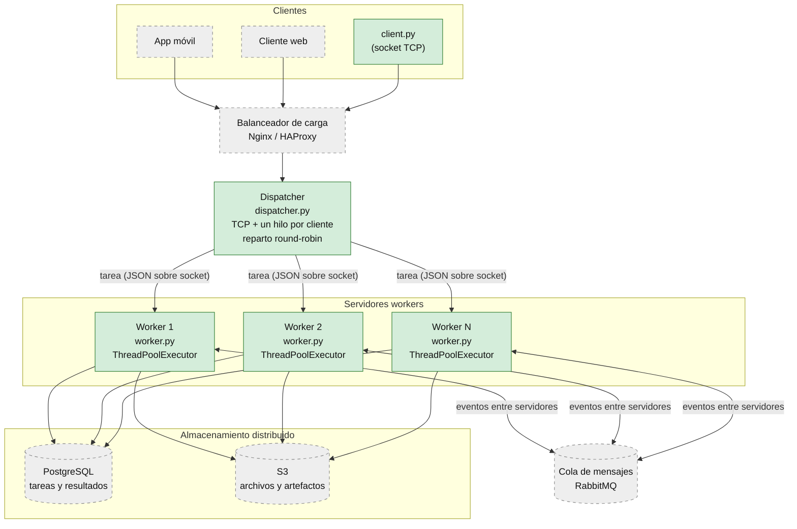

# Diagrama del sistema

Verde: implementado en Python. Gris: parte del diseño, no implementado.

```mermaid
flowchart TB
    subgraph CLIENTS["Clientes"]
        MOB["App móvil"]
        WEB["Cliente web"]
        CLI["client.py<br/>(socket TCP)"]
    end

    LB["Balanceador de carga<br/>Nginx / HAProxy"]

    DISP["Dispatcher<br/>dispatcher.py<br/>TCP + un hilo por cliente<br/>reparto round-robin"]

    subgraph WORKERS["Servidores workers"]
        W1["Worker 1<br/>worker.py<br/>ThreadPoolExecutor"]
        W2["Worker 2<br/>worker.py<br/>ThreadPoolExecutor"]
        W3["Worker N<br/>worker.py<br/>ThreadPoolExecutor"]
    end

    MQ[("Cola de mensajes<br/>RabbitMQ")]

    subgraph STORAGE["Almacenamiento distribuido"]
        PG[("PostgreSQL<br/>tareas y resultados")]
        S3[("S3<br/>archivos y artefactos")]
    end

    MOB --> LB
    WEB --> LB
    CLI --> LB
    LB --> DISP

    DISP -- "tarea (JSON sobre socket)" --> W1
    DISP -- "tarea (JSON sobre socket)" --> W2
    DISP -- "tarea (JSON sobre socket)" --> W3

    W1 <-- "eventos entre servidores" --> MQ
    W2 <-- "eventos entre servidores" --> MQ
    W3 <-- "eventos entre servidores" --> MQ

    W1 --> PG
    W2 --> PG
    W3 --> PG
    W1 --> S3
    W2 --> S3
    W3 --> S3

    classDef impl fill:#d4edda,stroke:#2e7d32,color:#111
    classDef design fill:#eeeeee,stroke:#888,stroke-dasharray: 5 5,color:#111
    class CLI,DISP,W1,W2,W3 impl
    class MOB,WEB,LB,MQ,PG,S3 design
```
